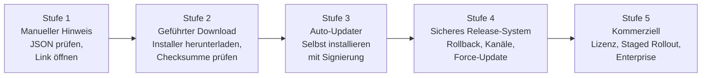
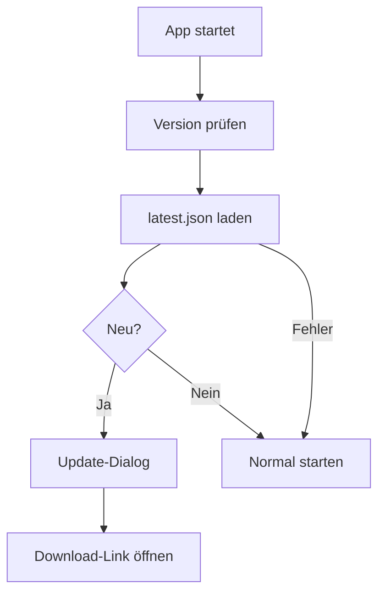

# MGD App Updater Skill

**Das deutschsprachige Open-Source-Handbuch für sichere Software-Update-Systeme.**

Ein universeller Skill für KI-Agenten und Entwickler — technologie-neutral, sicherheitsorientiert, schrittweise.

---

## Was ist MGD App Updater Skill?

Dieser Skill ist eine **Planungs- und Dokumentationsstruktur** für Software-Update-Systeme. Kein fertiges Framework. Kein Boilerplate-Code. Stattdessen: ein strukturiertes Vorgehen das KI-Agenten zwingt, **zuerst zu denken und dann zu implementieren**.

Update-Systeme ersetzen Software auf dem Rechner des Nutzers. Das macht sie sicherheitskritisch. Ein schlecht implementierter Updater kann zur Remote-Code-Execution-Schwachstelle werden. Dieser Skill verhindert das durch strukturiertes Vorgehen.

---

## Warum existiert dieses Projekt?

KI-Agenten neigen dazu, sofort Code zu schreiben wenn sie "Bau mir einen Updater" hören. Das ist gefährlich.

Dieser Skill erzwingt folgendes Vorgehen:

```
Analyse → Architektur → Risiken → Roadmap → Checkliste → Fragen → Erst dann: Code
```

Außerdem fehlte bislang ein **hochwertiges deutschsprachiges Referenzwerk** zum Thema Software-Update-Systeme das alle gängigen Technologien und Plattformen abdeckt.

---

## Für wen ist dieser Skill?

**KI-Agenten:**
- ChatGPT Codex
- Claude Code
- Cursor
- Windsurf
- Gemini CLI
- Andere Coding-Agenten

**Entwickler:**
- Indie-Entwickler die ein erstes Update-System einbauen wollen
- Open-Source-Maintainer die professionelle Releases anbieten wollen
- Teams die Update-Systeme sicher skalieren wollen

---

## Unterstützte Technologien

### Desktop

| Technologie | Plattformen |
|------------|-------------|
| Flutter Desktop | macOS, Windows, Linux |
| Electron | macOS, Windows, Linux |
| Tauri | macOS, Windows, Linux |
| Swift / SwiftUI | macOS |
| C# WPF / WinUI | Windows |
| Qt | macOS, Windows, Linux |
| Native (C++, Go, Rust) | macOS, Windows, Linux |

### Mobile

| Technologie | Plattformen |
|------------|-------------|
| Flutter Mobile | iOS, Android |
| Swift / SwiftUI | iOS, macOS |
| Kotlin / Java | Android |
| React Native | iOS, Android |

### Spiele

| Engine | Besonderheiten |
|--------|---------------|
| Unity | AssetBundles, Addressables, eigener Launcher |
| Godot | PCK-Content-Updates, GDScript |
| Unreal Engine | Pak-Dateien, eigener Updater |
| Flutter Flame | Wie Flutter Mobile/Desktop |

### Backend-Technologien

| Technologie | Einsatzgebiet |
|------------|---------------|
| PHP / Flight PHP | Einfache Update-APIs |
| Laravel | Update-APIs mit Lizenzprüfung |
| Symfony | Enterprise Update-APIs |
| Node.js / Express | Leichtgewichtige APIs |
| NestJS | Typsichere APIs |
| ASP.NET | .NET-Ökosystem |
| Go | Hochperformante APIs |
| Python FastAPI | Schnelle Prototypen |

### Deployment

| Option | Geeignet für |
|--------|-------------|
| GitHub Releases | Open-Source, öffentliche Tools |
| Self-Hosted | Maximale Kontrolle |
| CDN | Große Nutzerzahlen |
| S3-kompatibler Speicher | Skalierbar, günstig |
| Docker / Kubernetes | Containerisierte APIs |

---

## Philosophie

> Planen vor Implementieren.
> Sicherheit vor Komfort.
> Einfach starten, sicher wachsen.

Der Skill ist **technologie-neutral**. Er setzt keine bestimmte Sprache, kein Framework, keinen Hosting-Anbieter voraus. Stattdessen erkennt er zuerst:

- Plattform und Technologie
- Verteilungsmodell
- Sicherheitsanforderungen
- Zielgruppe

Und empfiehlt dann die passende Architektur.

---

## Update-Reifegrade



**Die meisten Projekte starten bei Stufe 1.**

| Stufe | Wann wechseln |
|-------|--------------|
| 1 → 2 | Wenn Phase 1 stabil läuft |
| 2 → 3 | Erst mit Code-Signierung |
| 3 → 4 | Wenn Rollback nötig wird |
| 4 → 5 | Bei kommerziellem Modell |

---

## Schnellstart

### Schritt 1 — Skill für den Agenten laden

```text
skill/SKILL.md
```

### Schritt 2 — Agenten-Prompt

```text
Verwende den MGD App Updater Skill.
Analysiere mein Projekt und erstelle eine Phase-1-Roadmap.
Schreibe noch keinen Code.
Erkläre zuerst Architektur, Risiken, Checkliste und offene Fragen.
```

### Schritt 3 — Minimalstruktur (Phase 1)



### Schritt 4 — Minimales Manifest

```json
{
  "app": "example-app",
  "platform": "macos",
  "latestVersion": "1.0.1",
  "minimumVersion": "1.0.0",
  "downloadUrl": "https://updates.example.com/example-app/releases/example-app-1.0.1-macos.dmg",
  "changelog": [
    "Update-Prüfung hinzugefügt",
    "Startproblem behoben"
  ],
  "forceUpdate": false,
  "publishedAt": "2026-06-17"
}
```

---

## Skill-Kommandos

```text
/updateservice analyse           — Technologie und Projekttyp erkennen
/updateservice roadmap           — Phasen-Roadmap erstellen
/updateservice architecture      — Architektur planen
/updateservice phase1            — Phase 1 umsetzen
/updateservice phase2            — Phase 2 umsetzen
/updateservice phase3            — Phase 3 umsetzen
/updateservice security          — Sicherheitsanalyse

Plattform:
/updateservice flutter           — Flutter (Desktop oder Mobile)
/updateservice swift             — Swift / SwiftUI
/updateservice electron          — Electron
/updateservice tauri             — Tauri
/updateservice unity             — Unity
/updateservice godot             — Godot
/updateservice mobile            — Mobile allgemein
/updateservice android           — Android
/updateservice ios               — iOS

Backend:
/updateservice php               — PHP Update-API
/updateservice laravel           — Laravel
/updateservice nodejs            — Node.js
/updateservice selfhosted        — Self-Hosted-Server
/updateservice github            — GitHub-Releases

Spezial:
/updateservice game              — Spiel-Client
/updateservice api-client        — API-abhängige App
/updateservice license           — Lizenzserver
/updateservice content           — Content-Updates
/updateservice checklist         — Passende Checkliste
```

---

## Beispiele

| Beispiel | Datei |
|----------|-------|
| Flutter Desktop | [`examples/flutter-desktop.md`](examples/flutter-desktop.md) |
| Flutter Mobile | [`examples/flutter-mobile.md`](examples/flutter-mobile.md) |
| Swift macOS | [`examples/swift-macos.md`](examples/swift-macos.md) |
| Swift iOS | [`examples/swift-ios.md`](examples/swift-ios.md) |
| Electron | [`examples/electron.md`](examples/electron.md) |
| Tauri | [`examples/tauri.md`](examples/tauri.md) |
| Unity | [`examples/unity.md`](examples/unity.md) |
| Godot | [`examples/godot.md`](examples/godot.md) |
| PHP Update-API | [`examples/php-update-api.md`](examples/php-update-api.md) |
| Laravel | [`examples/laravel-update-api.md`](examples/laravel-update-api.md) |
| Symfony | [`examples/symfony-update-api.md`](examples/symfony-update-api.md) |
| Node.js | [`examples/nodejs-update-api.md`](examples/nodejs-update-api.md) |
| Spiel-Client | [`examples/game-client.md`](examples/game-client.md) |
| Wetter-App | [`examples/weather-app.md`](examples/weather-app.md) |
| API-Client | [`examples/api-client.md`](examples/api-client.md) |

---

## Projektstruktur

```text
README.md
LICENSE
IMPRESSUM.md
CHANGELOG.md
CONTRIBUTING.md

skill/
  SKILL.md                         — Kern-Skill (hier starten)

wiki/
  01-Einfuehrung.md
  02-Grundlagen.md
  03-Architektur.md
  04-Phase-1-Manuelle-Updates.md
  05-Phase-2-Gefuehrte-Downloads.md
  06-Phase-3-Auto-Updater.md
  07-Sicherheit.md
  08-Plattformen.md
  09-Swift-und-SwiftUI.md
  10-PHP-Backends.md
  11-API-Clients.md
  12-Spiele-und-Content-Updates.md
  13-GitHub-Releases.md
  14-Self-Hosted-Updates.md
  15-Lizenzserver.md
  16-FAQ.md
  17-Glossar.md

examples/                          — 15 Beispiele (flutter, swift, electron, unity, godot, php, laravel, nodejs, ...)
checklists/                        — 8 Plattform- und Phasen-Checklisten
templates/                         — JSON-Templates und Release-Prozess
```

---

## Sicherheit

Update-Systeme ersetzen Software auf Nutzerrechnern. Die wichtigsten Regeln:

**Niemals:**
- Private Tokens, API-Keys, Signing-Zertifikate in eine ausgelieferte App einbetten
- Remote-Skripte ohne Verifikation ausführen
- Binärdateien ohne Integritätsprüfung ersetzen
- HTTP für Manifeste oder Downloads verwenden

**Immer:**
- HTTPS für alle Update-Kommunikation
- SHA-256 Checksummen für Downloads (Phase 2+)
- Code-Signierung vor Auto-Installer (Phase 3)
- Netzwerkfehler still behandeln — App darf nicht abstürzen

Alles was in eine App ausgeliefert wird, muss als extrahierbar betrachtet werden.

→ Vollständig: [`wiki/07-Sicherheit.md`](wiki/07-Sicherheit.md)

---

## Öffentlichkeitsprinzip

Dieses Repository ist öffentlich. Daher gilt:

- Keine privaten Repositories, Kundenprojekte oder NDA-Inhalte erwähnen
- Keine internen Server oder privaten URLs
- Im Zweifel: nicht erwähnen

Alle Beispiele verwenden generische Namen: `example-app`, `updates.example.com`, `api.example.com`.

---

## Wiki — Das vollständige Handbuch

→ **[`wiki/01-Einfuehrung.md`](wiki/01-Einfuehrung.md)** — Hier starten

---

## Lizenz

MIT License. Siehe [`LICENSE`](LICENSE).

---

## Impressum

Siehe [`IMPRESSUM.md`](IMPRESSUM.md).

---

*MGD App Updater Skill — von [Michael Gahn DESIGN](https://michael-gahn.de)*
