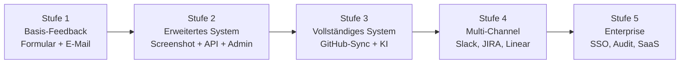
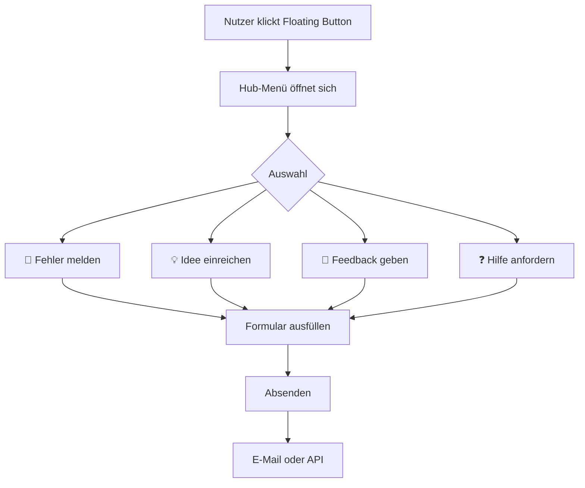

# MGD Bugreport Skill

**Das deutschsprachige Open-Source-Handbuch für professionelle Feedback- und Bug-Report-Systeme.**

Ein universeller Skill für KI-Agenten und Entwickler — technologie-neutral, datenschutzorientiert, schrittweise.

---

## Was ist MGD Bugreport Skill?

Dieser Skill ist eine **Planungs- und Dokumentationsstruktur** für Feedback-Systeme in Software-Projekten. Kein fertiges Widget. Kein Boilerplate-Code. Stattdessen: ein strukturiertes Vorgehen das KI-Agenten zwingt, **zuerst zu planen und dann zu implementieren**.

Ein Feedback-Hub erfasst Nutzerdaten, Screenshots und technische Geräteinformationen. Das macht ihn datenschutzrelevant. Dieser Skill verhindert falsche Implementierungen durch strukturiertes Vorgehen.

---

## Feedback-Hub-Konzept

Der Standardbutton öffnet ein Menü:

| Symbol | Funktion |
|--------|----------|
| 🐞 | Fehler melden |
| 💡 | Idee einreichen |
| 📢 | Feedback geben |
| ❓ | Hilfe anfordern |

Der Entwickler entscheidet welche Einträge aktiv sind und welche nicht.

---

## Warum existiert dieses Projekt?

KI-Agenten neigen dazu, sofort einen Bug-Button zu schreiben wenn sie "Bau mir einen Feedback-Button" hören. Das ist problematisch weil:

- Screenshots können sensible Daten enthalten
- Technische Gerätedaten sind personenbezogen
- DSGVO-Anforderungen werden oft übersehen
- Datenspeicherung ohne Konzept erzeugt Compliance-Probleme

Dieser Skill erzwingt folgendes Vorgehen:

```
Technologie → UX → Datenschutz → Screenshot-Strategie → Datenmodell → Backend → Erst dann: Code
```

---

## Für wen ist dieser Skill?

**KI-Agenten:**
- ChatGPT Codex
- Claude Code
- Cursor
- Windsurf
- Gemini CLI
- Andere Coding-Agenten

**Entwickler:**
- Indie-Entwickler die ein erstes Feedback-System einbauen wollen
- Open-Source-Maintainer die Nutzerfeedback professionell erfassen wollen
- Teams die QA-Workflows in ihre Apps integrieren wollen

---

## Was enthält v1.0?

- Professionelles README auf Deutsch
- Vollständiges Wiki mit 16 Kapiteln
- Mermaid-Diagramme für alle Architekturen
- Echte Referenzarchitekturen für 13 Plattformen
- Release 1.0.0 auf GitHub
- GitHub Topics für maximale Auffindbarkeit

**Geplant für v1.x:**
- Fertige Widget-Implementierungen für Flutter, Swift, React und Vue
- Admin-Panel-Vorlage

---

## Unterstützte Technologien

### Desktop

| Technologie | Plattformen |
|------------|-------------|
| Flutter Desktop | macOS, Windows, Linux |
| Electron | macOS, Windows, Linux |
| Tauri | macOS, Windows, Linux |
| Swift / SwiftUI | macOS |
| C# WPF / WinUI | Windows |
| Qt | macOS, Windows, Linux |

### Mobile

| Technologie | Plattformen |
|------------|-------------|
| Flutter Mobile | iOS, Android |
| Swift / SwiftUI | iOS |
| Kotlin / Java | Android |
| React Native | iOS, Android |

### Web

| Technologie | Einsatzgebiet |
|------------|---------------|
| React | SPAs, Next.js |
| Vue | SPAs, Nuxt.js |
| Angular | Enterprise-Webanwendungen |
| Vanilla JS | Einfache Web-Apps |

### Spiele

| Engine | Besonderheiten |
|--------|---------------|
| Unity | Screenshot via RenderTexture |
| Godot | Screenshot via Viewport |
| Unreal Engine | Screenshot via ConsoleCommand |

### Backend

| Technologie | Einsatzgebiet |
|------------|---------------|
| PHP | Einfache Feedback-APIs |
| Laravel | Feedback-APIs mit Admin-Panel |
| Symfony | Enterprise-Feedback-APIs |
| Node.js / Express | Leichtgewichtige APIs |
| NestJS | Typsichere APIs |
| ASP.NET | .NET-Ökosystem |
| Go | Hochperformante APIs |
| Python FastAPI | Schnelle Prototypen |

---

## Reifegrade



**Die meisten Projekte starten bei Stufe 1.**

| Stufe | Wann wechseln |
|-------|--------------|
| 1 → 2 | Wenn Phase 1 stabil läuft |
| 2 → 3 | Mit eigenem Backend und Admin-Bereich |
| 3 → 4 | Bei aktivem Team mit externen Tools |
| 4 → 5 | Bei kommerziellem Modell |

---

## Schnellstart

### Schritt 1 — Skill für den Agenten laden

```text
skill/SKILL.md
```

### Schritt 2 — Agenten-Prompt

```text
Verwende den MGD Bugreport Skill.
Analysiere mein Projekt und erstelle eine Phase-1-Roadmap.
Schreibe noch keinen Code.
Erkläre zuerst Hub-Konfiguration, Screenshot-Strategie, Datenschutz, Architektur und offene Fragen.
```

### Schritt 3 — Phase-1-Architektur



### Schritt 4 — Minimales Datenmodell

```json
{
  "type": "bug",
  "title": "Login schlägt fehl",
  "description": "Beim Klick auf Login passiert nichts",
  "severity": "high",
  "screenshot": null,
  "systemInfo": {
    "os": "macOS 14.5",
    "appVersion": "1.0.0",
    "language": "de"
  },
  "submittedAt": "2026-06-17T10:00:00Z"
}
```

---

## Skill-Kommandos

```text
/bugreport analyse              — Technologie und Datenschutz analysieren
/bugreport roadmap              — Phasen-Roadmap erstellen
/bugreport architecture         — Architektur planen
/bugreport phase1               — Phase 1 umsetzen
/bugreport phase2               — Phase 2 umsetzen
/bugreport phase3               — Phase 3 umsetzen
/bugreport datenschutz          — Datenschutz-Analyse
/bugreport checklist            — Passende Checkliste wählen

Plattform:
/bugreport flutter              — Flutter (Desktop oder Mobile)
/bugreport swift                — Swift / SwiftUI
/bugreport electron             — Electron
/bugreport tauri                — Tauri
/bugreport unity                — Unity
/bugreport godot                — Godot
/bugreport android              — Android
/bugreport ios                  — iOS
/bugreport web                  — Web App
/bugreport react                — React
/bugreport vue                  — Vue

Backend:
/bugreport php                  — PHP Backend
/bugreport laravel              — Laravel
/bugreport nodejs               — Node.js
/bugreport selfhosted           — Self-Hosted

Spezial:
/bugreport screenshot           — Screenshot-Strategie
/bugreport hub                  — Hub konfigurieren
/bugreport admin                — Admin-Bereich planen
/bugreport dsgvo                — DSGVO-Compliance
/bugreport github-sync          — GitHub-Integration
```

---

## Beispiele

| Beispiel | Datei |
|----------|-------|
| Flutter Desktop | [`examples/flutter-desktop.md`](examples/flutter-desktop.md) |
| Flutter Mobile | [`examples/flutter-mobile.md`](examples/flutter-mobile.md) |
| Swift macOS | [`examples/swift-macos.md`](examples/swift-macos.md) |
| Swift iOS | [`examples/swift-ios.md`](examples/swift-ios.md) |
| Electron | [`examples/electron.md`](examples/electron.md) |
| Tauri | [`examples/tauri.md`](examples/tauri.md) |
| Unity | [`examples/unity.md`](examples/unity.md) |
| Godot | [`examples/godot.md`](examples/godot.md) |
| PHP Backend | [`examples/php-backend.md`](examples/php-backend.md) |
| Laravel Backend | [`examples/laravel-backend.md`](examples/laravel-backend.md) |
| Node.js Backend | [`examples/nodejs-backend.md`](examples/nodejs-backend.md) |
| React Web | [`examples/react-web.md`](examples/react-web.md) |
| Vue Web | [`examples/vue-web.md`](examples/vue-web.md) |

---

## Projektstruktur

```text
README.md
LICENSE
IMPRESSUM.md
CHANGELOG.md
CONTRIBUTING.md

skill/
  SKILL.md                         — Kern-Skill (hier starten)

wiki/
  01-Einfuehrung.md
  02-Feedback-Hub.md
  03-Fehler-Melden.md
  04-Ideen-Einreichen.md
  05-Feedback-Geben.md
  06-Hilfe-Anfordern.md
  07-Screenshot-Funktion.md
  08-Technische-Daten.md
  09-Floating-Button.md
  10-Einstellungen.md
  11-Backend-und-Admin.md
  12-GitHub-Integration.md
  13-Datenschutz.md
  14-Plattformen.md
  15-FAQ.md
  16-Glossar.md

examples/                          — 13 Beispiele
checklists/                        — 7 Checklisten
templates/                         — JSON-Templates
```

---

## Datenschutz

Feedback-Systeme erfassen sensible Daten. Die wichtigsten Regeln:

**Niemals:**
- Screenshots ohne Nutzereinwilligung auf Mobile-Plattformen
- Personenbezogene Daten ohne Datenschutzhinweis erfassen
- Systemdaten ohne Opt-out übertragen
- Daten unverschlüsselt über HTTP senden

**Immer:**
- HTTPS für alle Datenübertragungen
- Opt-out für technische Daten anbieten
- Screenshot-Vorschau vor dem Senden zeigen
- Datenschutzerklärung verlinken

→ Vollständig: [`wiki/13-Datenschutz.md`](wiki/13-Datenschutz.md)

---

## Öffentlichkeitsprinzip

Dieses Repository ist öffentlich. Daher gilt:

- Keine privaten Repositories, Kundenprojekte oder NDA-Inhalte erwähnen
- Keine internen Server oder privaten URLs
- Im Zweifel: nicht erwähnen

Alle Beispiele verwenden generische Namen: `example-app`, `feedback.example.com`, `api.example.com`.

---

## Verwandte MGD Projekte

| Projekt | Beschreibung |
|---------|-------------|
| [MGD-App-Updater-Skill](https://github.com/MichaelGahnDESIGN/MGD-App-Updater-Skill) | Software-Update-Systeme planen und implementieren |
| [MGD-ToDo-SKILL](https://github.com/MichaelGahnDESIGN/MGD-ToDo-SKILL) | Aufgabenmanagement direkt im Projekt-Repo |
| [MGD-AI-PlayTest-Skill](https://github.com/MichaelGahnDESIGN/MGD-AI-PlayTest-Skill) | Live-Playtest aus Nutzerperspektive |
| [MGD-DEV-Skill](https://github.com/MichaelGahnDESIGN/MGD-DEV-Skill) | Release, Sync, Backup und Wissensdokumentation |
| [MGD-AI-Basic-Projektordner](https://github.com/MichaelGahnDESIGN/MGD-AI-Basic-Projektordner) | Projektvorlage für KI-Agenten |

→ Alle öffentlichen Projekte: [github.com/MichaelGahnDESIGN](https://github.com/MichaelGahnDESIGN)

---

## Wiki — Das vollständige Handbuch

→ **[`wiki/01-Einfuehrung.md`](wiki/01-Einfuehrung.md)** — Hier starten

---

## Lizenz

MIT License. Siehe [`LICENSE`](LICENSE).

---

## Verwandte MGD Projekte

| Projekt | Beschreibung |
|---------|-------------|
| [MGD-Bugreport-Skill](https://github.com/MichaelGahnDESIGN/MGD-Bugreport-Skill) | Feedback-Hub: Bug-Meldung, Ideen und Support |
| [MGD-ToDo-SKILL](https://github.com/MichaelGahnDESIGN/MGD-ToDo-SKILL) | Aufgabenmanagement direkt im Projekt-Repo |
| [MGD-AI-PlayTest-Skill](https://github.com/MichaelGahnDESIGN/MGD-AI-PlayTest-Skill) | Live-Playtest aus Nutzerperspektive |
| [MGD-ProjectClean-Skill](https://github.com/MichaelGahnDESIGN/MGD-ProjectClean-Skill) | Abschluss- und Aufräum-Workflow |
| [MGD-AI-Basic-Projektordner](https://github.com/MichaelGahnDESIGN/MGD-AI-Basic-Projektordner) | Projektvorlage für KI-Agenten |

→ Alle öffentlichen Projekte: [github.com/MichaelGahnDESIGN](https://github.com/MichaelGahnDESIGN)

---

## Impressum

Siehe [`IMPRESSUM.md`](IMPRESSUM.md).

---

*MGD Bugreport Skill — von [Michael Gahn DESIGN](https://michael-gahn.de)*
