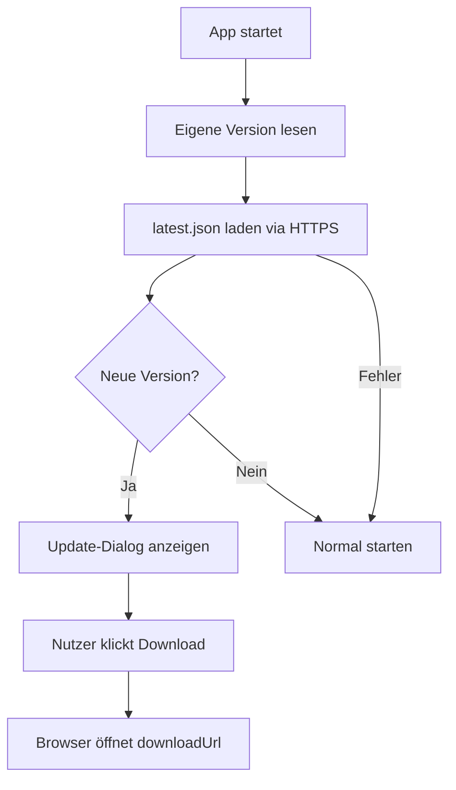

# MGD App Updater Skill

Version 1.0 | [github.com/MichaelGahnDESIGN/MGD-App-Updater-Skill](https://github.com/MichaelGahnDESIGN/MGD-App-Updater-Skill)

---

## Zweck

Der MGD App Updater Skill hilft Entwicklern und KI-Agenten dabei, Software-Update-Systeme sicher, wartbar und schrittweise zu **planen**, zu **dokumentieren** und umzusetzen.

Der Skill ist **technologie-neutral**. Er setzt keine bestimmte Sprache, kein Framework, keinen Hosting-Anbieter und kein privates Projekt voraus.

Er funktioniert für:
- Desktop-Apps (Flutter, Electron, Tauri, Swift, C#, Qt, native)
- Mobile Apps (Flutter, Swift, Kotlin, React Native)
- Spiele (Unity, Godot, Unreal Engine, Flame)
- SaaS-Clients, API-Clients, interne Tools
- Open-Source- und Closed-Source-Software

---

## Kernregel — Erst planen, dann implementieren

**Wenn dieser Skill aufgerufen wird: Sofort keinen Code schreiben.**

Update-Systeme ersetzen Software auf dem Rechner des Nutzers. Das macht sie sicherheitskritisch. Ein schlecht implementierter Updater kann zur Remote-Code-Execution-Schwachstelle werden.

### Pflichtschritte vor jeder Implementierung

```
Schritt 1 — Analyse
  ├── Projekttyp identifizieren
  ├── Technologie-Stack klären
  ├── Zielplattformen feststellen
  ├── Verteilungsmodell klären (öffentlich / privat / lizenziert / intern)
  ├── Open Source oder Closed Source?
  └── Externe API-Abhängigkeiten?

Schritt 2 — Architektur
  ├── Einfachste sichere Architektur empfehlen
  ├── Statisches JSON vs. API-Endpunkt abwägen
  └── Release-Speicher wählen

Schritt 3 — Risiken
  ├── Sicherheitsrisiken benennen
  ├── Signierungsanforderungen klären
  └── Was passiert bei Netzwerkfehler?

Schritt 4 — Roadmap
  └── Phasenweise: Phase 1 → Phase 2 → Phase 3

Schritt 5 — Checkliste
  └── Plattformspezifisch aus /checklists/ wählen

Schritt 6 — Offene Fragen
  └── Alle ungeklärten Punkte auflisten

Schritt 7 — Erst jetzt: Umsetzung
  └── Code / Konfiguration / Skripte
```

---

## Technologie-Erkennung

Vor jeder Empfehlung muss der Agent erkennen:

### Plattform

| Plattform | Typische Technologien |
|-----------|----------------------|
| macOS Desktop | Flutter, Electron, Tauri, Swift/SwiftUI, Qt, native |
| Windows Desktop | Flutter, Electron, Tauri, C# WPF/WinUI, Qt, native |
| Linux Desktop | Flutter, Electron, AppImage, Qt, native |
| iOS | Swift, SwiftUI, Flutter, React Native |
| Android | Kotlin, Java, Flutter, React Native |
| Spiele | Unity, Godot, Unreal Engine, Flame |
| Server / CLI | Node.js, Go, Python, PHP, .NET |

### Verteilungsmodell

| Modell | Update-Strategie |
|--------|-----------------|
| Direktdownload (eigene Website) | Statisches JSON-Manifest |
| GitHub Releases (Open Source) | GitHub API oder statisches Manifest |
| App Store (iOS/macOS) | Nur Mindestversionscheck, kein Installer |
| Google Play (Android) | Nur Mindestversionscheck, kein Installer |
| Enterprise-Verteilung | MDM, signierte Pakete, interne Server |
| Self-Hosted | Eigene API, volle Kontrolle |

### Sicherheitsanforderungen

Wenn die App persönliche Daten, Zahlungen oder sicherheitskritische Funktionen hat: Signierung und Checksummen sind Pflicht, nicht optional.

---

## Agenten-Regeln

### Wie Claude Code arbeiten soll

Claude Code hat Zugriff auf das Dateisystem und kann Code direkt schreiben. Dennoch gilt:

1. Zuerst `skill/SKILL.md` lesen und den Planungsschritt ausführen
2. Projektdateien analysieren: `package.json`, `pubspec.yaml`, `Info.plist`, `Cargo.toml` — was verrät die Technologie?
3. Analyse und Architektur im Chat ausgeben
4. Offene Fragen stellen
5. Erst nach Bestätigung Code schreiben

Claude Code soll nicht raten. Wenn die Technologie unklar ist: nachfragen.

### Wie ChatGPT Codex arbeiten soll

Codex hat ebenfalls Dateizugriff und kann direkt in Repos schreiben. Daher:

1. Skill lesen
2. Repo analysieren: vorhandene Struktur, verwendete Frameworks, bestehende Update-Logik
3. Analyse und Plan als Ausgabe erzeugen
4. Update-Manifest-Struktur vorschlagen (kein Code)
5. Warten auf Bestätigung
6. Dann implementieren

Codex neigt dazu, sofort zu implementieren. Der Skill soll das explizit verhindern.

### Wie Cursor arbeiten soll

Cursor analysiert Code direkt im Editor-Kontext:

1. Skill als Kontext hinzufügen (SKILL.md einfügen oder referenzieren)
2. Aktuelle Datei / geöffnetes Projekt analysieren lassen
3. Planungsphase im Chat durchführen
4. Erst dann Code-Änderungen vornehmen lassen

### Wie Windsurf arbeiten soll

Windsurf (Codeium) hat agentenbasierte Flows:

1. SKILL.md als Systemkontext übergeben
2. Cascade-Flow: Analyse → Planung → Implementierung
3. Nicht in einem Schritt alles schreiben lassen

### Wie Gemini CLI arbeiten soll

Gemini CLI kann Dateien lesen und schreiben:

1. `--system_prompt` oder Kontext mit SKILL.md belegen
2. Erst Analyseergebnis ausgeben lassen
3. Dann schrittweise implementieren

### Allgemeines Prinzip für alle Agenten

```
Eingabe: "Bau mir einen Updater"
                ↓
FALSCH: Sofort Code schreiben
                ↓
RICHTIG: Analysieren → Planen → Fragen → Implementieren
```

Kein Agent soll Update-Code schreiben ohne vorher zu wissen:
- Auf welcher Plattform läuft die App?
- Wie wird die App verteilt?
- Ist Code-Signierung vorhanden?
- Was passiert bei einem Fehler?

---

## Trigger-Befehle

```text
/updateservice analyse           — Technologie und Projekttyp erkennen
/updateservice roadmap           — Phasen-Roadmap erstellen
/updateservice architecture      — Architektur planen
/updateservice phase1            — Phase 1 umsetzen
/updateservice phase2            — Phase 2 umsetzen
/updateservice phase3            — Phase 3 umsetzen
/updateservice security          — Sicherheitsanalyse
/updateservice checklist         — Passende Checkliste wählen

Plattform-spezifisch:
/updateservice flutter           — Flutter (Desktop oder Mobile)
/updateservice swift             — Swift / SwiftUI
/updateservice electron          — Electron
/updateservice tauri             — Tauri
/updateservice unity             — Unity (Spiel-Client)
/updateservice godot             — Godot
/updateservice mobile            — Mobile allgemein
/updateservice android           — Android (Kotlin / Java)
/updateservice ios               — iOS (Swift / React Native)

Backend:
/updateservice php               — PHP Update-API
/updateservice laravel           — Laravel Update-API
/updateservice nodejs            — Node.js Update-API
/updateservice selfhosted        — Self-Hosted-Server
/updateservice github            — GitHub-Releases-Workflow

Spezialfälle:
/updateservice game              — Spiel-Client-Planung
/updateservice api-client        — API-abhängige App
/updateservice license           — Lizenzserver-Integration
/updateservice content           — Content-Updates (Spiele, Assets)
```

---

## Update-Reifegrade

| Stufe | Name | Beschreibung | Wann |
|-------|------|-------------|------|
| 1 | Manueller Hinweis | App prüft JSON, zeigt Download-Link | Immer als Start |
| 2 | Geführter Download | App lädt Installer, prüft Checksumme | Wenn Phase 1 stabil |
| 3 | Auto-Updater | App installiert selbst | Erst mit Signierung |
| 4 | Sicheres Release-System | Signing, Rollback, Force-Update | Produktionsreife |
| 5 | Kommerzielle Distribution | Lizenz, Staged Rollout, Enterprise | Kommerziell |

**Die meisten Projekte starten bei Stufe 1 und wachsen langsam.**

---

## Standard Phase-1-Architektur



---

## Manifest-Felder

### Minimal (Phase 1)

```json
{
  "app": "example-app",
  "platform": "macos",
  "latestVersion": "1.0.1",
  "minimumVersion": "1.0.0",
  "downloadUrl": "https://updates.example.com/example-app/releases/example-app-1.0.1-macos.dmg",
  "changelog": ["Update-Prüfung hinzugefügt", "Startproblem behoben"],
  "forceUpdate": false,
  "publishedAt": "2026-06-17"
}
```

### Erweitert (Phase 2+)

```json
{
  "app": "example-app",
  "platform": "windows",
  "latestVersion": "1.1.0",
  "minimumVersion": "1.0.0",
  "downloadUrl": "https://updates.example.com/releases/example-app-1.1.0-windows.exe",
  "sha256": "a3f5b2c8d1e4f7a0b9c2d5e8f1a4b7c0d3e6f9a2b5c8d1e4f7a0b3c6d9e2f5a8",
  "fileSize": 45234176,
  "changelog": ["Automatischer Download-Dialog", "Verbesserte Fehlerbehandlung"],
  "forceUpdate": false,
  "channel": "stable",
  "publishedAt": "2026-06-17"
}
```

### API-Client-Erweiterung

```json
{
  "apiCompatibilityVersion": "api-v3",
  "minimumApiVersion": "api-v2",
  "remoteConfigUrl": "https://updates.example.com/config.json"
}
```

---

## Analyse-Fragen

Der Agent muss diese Fragen beantworten **bevor** er Code schreibt:

**Projekt:**
1. Welcher Typ? (Desktop-App, Mobile, Spiel, CLI, API-Client...)
2. Welche Technologie? (Flutter, Swift, Electron, Unity, PHP...)
3. Welche Zielplattformen jetzt? Welche später?
4. Open Source oder Closed Source?

**Distribution:**
5. Wie wird die App verteilt? (Download, App Store, Enterprise...)
6. Öffentliche oder private Downloads?
7. Gibt es bereits einen Release-Server?

**Sicherheit:**
8. Code-Signierung vorhanden?
9. Persönliche Daten oder Zahlungen im Spiel?
10. Muss die App nach einem Fehler rollbacken können?

**Betrieb:**
11. Wer darf Releases veröffentlichen?
12. Braucht die App erzwungene Updates?
13. Gibt es API-Abhängigkeiten die Updates erforderlich machen?
14. Sollen Updates im App-Store oder außerhalb stattfinden?
15. Ist Offline-Betrieb nötig?

---

## Ausgabeformat

Nach der Analyse immer in dieser Reihenfolge:

```
1. Projektinterpretation (3–5 Sätze)
2. Empfohlener Reifegrad (Stufe 1–5)
3. Vorgeschlagene Architektur (Diagramm oder Text)
4. Phasen-Roadmap
5. Sicherheitshinweise
6. Checkliste (Link auf passende Datei)
7. Erforderliche Entscheidungen
8. Nächster konkreter Schritt
```

---

## Was nicht zuerst bauen

- Keinen Auto-Updater ohne stabilen Release-Prozess
- Keine Delta-Updates zu Beginn
- Keinen Lizenzserver ohne konkreten kommerziellen Bedarf
- Keine versteckte Hintergrundinstallation ohne Signierung
- Keine privaten GitHub-Tokens in der ausgelieferten App

---

## Sicherheitsregeln (für Agenten)

Niemals empfehlen:
- Private GitHub-Tokens, API-Keys, Signing-Zertifikate oder Secrets in die App einzubetten
- Remote-Skripte ohne Verifikation auszuführen
- Binärdateien ohne Integritätsprüfung zu ersetzen
- HTTP statt HTTPS für Manifeste oder Downloads

Immer in Beispielen verwenden:
- `example-app` statt echter App-Namen
- `updates.example.com` statt echter Server-URLs
- `api.example.com` statt echter API-Endpunkte

---

## Öffentlichkeitsregel

Dieses Repository ist öffentlich.

Niemals erwähnen:
- Private Repositories oder Projekte
- Kundenprojekte oder NDA-Inhalte
- Interne Server, URLs oder Infrastruktur
- Konkrete Firmennamen ohne deren Erlaubnis

Im Zweifel: Nicht erwähnen.
