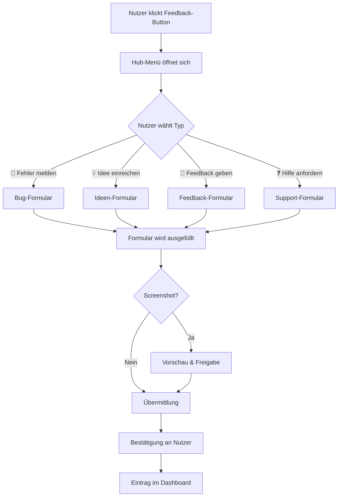

## Der Feedback Hub

Der Feedback Hub ist der zentrale Einstiegspunkt für alle Nutzer-Rückmeldungen innerhalb einer Anwendung. Er bündelt verschiedene Feedback-Typen unter einer einheitlichen Oberfläche und sorgt dafür, dass Nutzer die richtige Kategorie für ihr Anliegen wählen — anstatt alles als "Bug" oder als formlose E-Mail einzureichen.

### Konzept: Das Hub-Menü

Der Hub öffnet beim Klick auf einen Button (typischerweise ein schwebendes Icon oder ein Menüpunkt) ein Auswahlmenü mit bis zu vier Einträgen:

| Eintrag | Zweck | Standardmäßig aktiv |
|---|---|---|
| 🐞 Fehler melden | Software verhält sich nicht wie erwartet | Ja |
| 💡 Idee einreichen | Verbesserungsvorschlag oder neues Feature | Ja |
| 📢 Feedback geben | Freies Lob, Kritik oder Verbesserungswunsch | Ja |
| ❓ Hilfe anfordern | Nutzer kommt nicht weiter, braucht Unterstützung | Optional |

Jeder Eintrag kann vom Entwickler **einzeln aktiviert oder deaktiviert** werden. Eine minimalistische Installation kann nur "Fehler melden" und "Feedback geben" anbieten; eine vollständige Installation alle vier Typen.

### Ablauf: Vom Klick zur Übermittlung



### Hub-Typen im Detail

| Typ | Anwendungsfall | Pflichtfelder | Optionale Felder | Wann nutzen |
|---|---|---|---|---|
| Fehler melden | App stürzt ab, Button reagiert nicht, Daten werden falsch angezeigt | Titel, Beschreibung | Schweregrad, Screenshot, Kontakt | Software verhält sich falsch |
| Idee einreichen | "Es wäre toll, wenn man X könnte" | Titel, Beschreibung | Kategorie, Priorität, Screenshot | Neues Feature oder Verbesserung |
| Feedback geben | "Ich liebe die neue Ansicht" oder "Der Export-Dialog ist verwirrend" | Freitext | Bewertung (Sterne), Kategorie | Allgemeines Lob oder Kritik |
| Hilfe anfordern | Nutzer findet eine Funktion nicht, versteht eine Option nicht | Betreff, Beschreibung, Kontakt | Screenshot | Nutzer braucht eine Antwort |

### Konfigurierbarkeit

Der Entwickler kann den Hub über eine Konfigurationsdatei oder Initialisierungsparameter anpassen:

```json
{
  "hub": {
    "entries": {
      "bug_report": true,
      "idea_submission": true,
      "free_feedback": true,
      "help_request": false
    },
    "custom_entries": [
      {
        "id": "beta_feedback",
        "label": "Beta-Feedback",
        "icon": "🧪",
        "form": "templates/beta-feedback.json"
      }
    ]
  }
}
```

Benutzerdefinierte Einträge (`custom_entries`) ermöglichen es, projektspezifische Feedback-Typen hinzuzufügen, ohne den Kern-Skill zu verändern.

### Design-Empfehlungen

- Das Hub-Menü sollte **nicht modal** sein — es soll sich leicht schließen lassen (Klick außerhalb, ESC-Taste)
- Die Einträge sollten **kurze, klare Labels** haben — kein technischer Jargon
- Ein **Icon pro Eintrag** hilft bei der schnellen Orientierung
- Auf Mobilgeräten empfiehlt sich ein **Bottom Sheet** statt eines Dropdown-Menüs
- Der Hub-Button sollte **dauerhaft sichtbar** sein, aber nicht störend wirken (z. B. kleines schwebendes Icon in einer Ecke)

→ Weiter mit [wiki/03-Fehler-Melden.md](03-Fehler-Melden.md)
