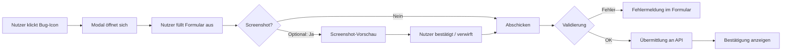

## Fehler melden

Das Bug-Report-Formular ist der häufigste Feedback-Typ und zugleich der anspruchsvollste. Es muss genug Informationen erfassen, damit der Entwickler den Fehler reproduzieren kann — ohne den Nutzer mit zu vielen Pflichtfeldern zu überfordern.

### Ablauf



### Formularfelder

| Feld | Typ | Pflicht | Hinweise |
|---|---|---|---|
| Titel | Text (max. 120 Zeichen) | Ja | Kurze Zusammenfassung des Problems |
| Beschreibung | Textarea (max. 2000 Zeichen) | Ja | Was ist passiert? Was wurde erwartet? |
| Schweregrad | Select (low / medium / high / critical) | Nein | Standard: medium |
| Screenshot | Datei-Upload oder automatisch | Nein | Vorschau vor dem Senden zeigen |
| Anhänge | Datei-Upload (max. 5 MB pro Datei) | Nein | Logs, Videos, weitere Bilder |
| Kontakt (E-Mail) | E-Mail | Nein | Wenn Rückfragen erwünscht |

**Schweregrad-Definitionen:**
- `low` — Kosmetisches Problem, kein Funktionsverlust
- `medium` — Funktion eingeschränkt, Workaround vorhanden
- `high` — Wichtige Funktion nicht nutzbar
- `critical` — App nicht verwendbar, Datenverlust möglich

### Automatisch erfasste technische Daten

Diese Daten werden ohne Nutzereingabe gesammelt, **sofern der Nutzer nicht widerspricht** (Opt-out):

| Datenpunkt | Beispielwert | Zweck |
|---|---|---|
| Betriebssystem | macOS 14.5 | Plattformspezifische Bugs |
| App-Version | 2.1.3 | Regression-Tracking |
| Sprache | de-DE | Lokalisierungsfehler |
| Zeitpunkt (UTC) | 2024-03-15T14:32:00Z | Zeitliche Eingrenzung |
| Aktuelle Seite / Route | /settings/profile | Kontextinformation |

### JSON-Datenmodell

```json
{
  "type": "bug_report",
  "id": "bug_20240315_a3f9",
  "timestamp": "2024-03-15T14:32:00Z",
  "form": {
    "title": "Export-Button reagiert nicht",
    "description": "Wenn ich auf Exportieren klicke, passiert nichts. Keine Fehlermeldung.",
    "severity": "high",
    "contact": "user@example.com"
  },
  "attachments": {
    "screenshot": "uploads/screenshot_a3f9.png",
    "files": []
  },
  "system": {
    "os": "macOS 14.5",
    "app_version": "2.1.3",
    "language": "de-DE",
    "route": "/dashboard/export",
    "opt_out_system_data": false
  }
}
```

### Datenschutz und Opt-out

Der Nutzer muss jederzeit die Möglichkeit haben, technische Daten **nicht** mitzusenden. Empfohlene UI-Umsetzung:

```
☑ Technische Daten mitsenden (OS, App-Version, aktuelle Seite)
  [Details anzeigen ▾]
```

Wenn `opt_out_system_data: true`, wird das `system`-Objekt aus dem Payload entfernt oder nur mit Minimalinfos (App-Version) befüllt.

Screenshots müssen **immer** eine Vorschau mit Bestätigungsschritt haben. Automatische Screenshots ohne Vorschau sind nicht DSGVO-konform.

### Fehlerbehandlung

| Fehlerfall | Ursache | Empfohlene Reaktion im UI |
|---|---|---|
| Netzwerkfehler | Keine Verbindung zum API-Server | "Bitte prüfe deine Internetverbindung. Du kannst es später erneut versuchen." |
| Datei zu groß | Anhang überschreitet Limit | "Die Datei ist zu groß (max. 5 MB). Bitte komprimiere sie oder wähle eine andere." |
| Formular unvollständig | Pflichtfelder leer | Felder rot markieren, Hinweistext direkt unter dem Feld |
| Server-Fehler (5xx) | Interner Fehler auf Serverseite | "Etwas ist schiefgelaufen. Dein Bericht wurde lokal gespeichert und wird erneut gesendet." |
| Duplikat erkannt | Identischer Report bereits vorhanden | "Es sieht aus, als wäre dieses Problem bereits bekannt. Möchtest du trotzdem senden?" |

### UX-Tipps

- Platzhaltertext in der Beschreibung: *"Was hast du erwartet? Was ist stattdessen passiert? Welche Schritte führen zum Fehler?"*
- Automatisches Speichern (localStorage) verhindert Datenverlust beim Schließen
- Nach erfolgreicher Übermittlung: kurze Bestätigung + Ticket-Nummer anzeigen
- Keine Pflicht zur E-Mail-Angabe — ermöglicht anonyme Reports

→ Weiter mit [wiki/04-Ideen-Einreichen.md](04-Ideen-Einreichen.md)
