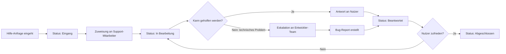

## Hilfe anfordern

Der Support-Kanal ist ein optionaler Feedback-Typ für Nutzer, die nicht weiterkommen. Im Gegensatz zu den anderen Feedback-Typen **erwartet der Nutzer eine Antwort** — deshalb ist das Kontaktfeld hier ein Pflichtfeld.

### Abgrenzung: Hilfe vs. Bug

Ein häufiges Missverständnis: Nutzer melden als "Bug", was eigentlich ein Bedienungsproblem ist.

| Situation | Richtiger Typ |
|---|---|
| "Der Speichern-Button macht nichts." | Bug melden |
| "Ich finde den Speichern-Button nicht." | Hilfe anfordern |
| "Die App stürzt beim Speichern ab." | Bug melden (critical) |
| "Ich weiß nicht, wie ich ein neues Projekt anlege." | Hilfe anfordern |

Diese Unterscheidung hilft dem Team: Bugs gehen ans Entwicklungs-Team, Hilfe-Anfragen an den Support.

### Formularfelder

| Feld | Typ | Pflicht | Hinweise |
|---|---|---|---|
| Betreff | Text (max. 120 Zeichen) | Ja | Kurze Zusammenfassung der Frage |
| Beschreibung | Textarea (max. 2000 Zeichen) | Ja | Was hast du versucht? Wo kommst du nicht weiter? |
| Kontakt (E-Mail) | E-Mail | Ja | Für Rückmeldung erforderlich |
| Screenshot | Datei-Upload | Nein | Zeigt den aktuellen Zustand der Oberfläche |

**Warum ist Kontakt hier Pflichtfeld?**
Der Nutzer erwartet eine Antwort. Ohne E-Mail ist eine Rückmeldung nicht möglich. Der Nutzer weiß das — er hat das Formular gewählt, weil er Hilfe braucht, nicht weil er anonym Feedback geben möchte.

### Support-Workflow



### JSON-Datenmodell

```json
{
  "type": "help_request",
  "id": "help_20240315_d8e1",
  "timestamp": "2024-03-15T11:20:00Z",
  "form": {
    "subject": "Wie lege ich ein neues Projekt an?",
    "description": "Ich habe auf 'Neu' geklickt, aber es öffnet sich kein Dialog. Ich nutze die App seit heute zum ersten Mal.",
    "contact": "user@example.com"
  },
  "attachments": {
    "screenshot": "uploads/screenshot_help_d8e1.png"
  },
  "status": {
    "current": "incoming",
    "history": [
      { "state": "incoming", "timestamp": "2024-03-15T11:20:00Z" }
    ]
  },
  "system": {
    "app_version": "2.1.3",
    "language": "de-DE",
    "route": "/dashboard"
  }
}
```

### Automatische Antworten

Für häufige Fragen können automatische Antworten eingesetzt werden. Der Workflow:

1. Nutzer sendet Hilfe-Anfrage
2. System vergleicht Betreff und Beschreibung mit einer FAQ-Datenbank
3. Bei Treffer: automatische Antwort mit Artikel-Link wird sofort gesendet
4. Parallel: Anfrage geht trotzdem ans Team, falls die automatische Antwort nicht hilft

**Empfehlung:** Automatische Antworten nur einsetzen, wenn die FAQ-Datenbank gepflegt ist. Veraltete automatische Antworten schaden dem Vertrauen mehr als gar keine.

### Eskalations-Logik

Wenn eine Hilfe-Anfrage ein technisches Problem offenbart (Nutzer kann etwas wegen eines Bugs nicht tun), sollte der Support-Mitarbeiter die Anfrage in einen Bug-Report umwandeln können:

- Neuen Bug-Report aus der Hilfe-Anfrage erstellen (Daten übernehmen)
- Hilfe-Anfrage mit dem Bug-Report verknüpfen
- Nutzer informieren: "Wir haben ein technisches Problem erkannt und nehmen es als Fehlerreport auf."

### Datenschutz

Das Kontaktfeld enthält eine E-Mail-Adresse — das ist ein personenbezogenes Datum im Sinne der DSGVO.

- E-Mail-Adressen dürfen **nur** für die Beantwortung der Anfrage genutzt werden
- Keine Weitergabe an Dritte ohne explizite Einwilligung
- Löschung nach Abschluss der Anfrage (Aufbewahrungsfrist definieren, z. B. 90 Tage)
- Hinweis im Formular: "Deine E-Mail-Adresse wird nur für die Beantwortung dieser Anfrage genutzt."

### UX-Tipps

- E-Mail-Validierung in Echtzeit (kein Absenden bei ungültiger Adresse)
- Platzhaltertext Beschreibung: *"Was hast du versucht zu tun? Wo genau kommst du nicht weiter?"*
- Bestätigungsseite mit Ticket-Nummer: "Wir haben deine Anfrage erhalten (Ticket #12345). Du erhältst innerhalb von 24 Stunden eine Antwort."
- Antwort-SLA transparent kommunizieren, wenn möglich

→ Weiter mit [wiki/07-Screenshot-Funktion.md](07-Screenshot-Funktion.md)
