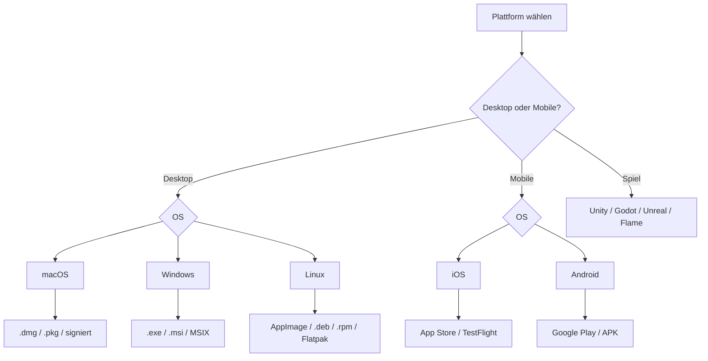

# 08. Plattformen

Jede Plattform hat eigene Formate, Sicherheitsanforderungen und Eigenheiten. Dieser Abschnitt gibt einen Überblick.

---

## Überblick



---

## macOS

### Formate

| Format | Beschreibung |
|--------|-------------|
| `.dmg` | Disk-Image — Standard für die meisten macOS-Apps |
| `.pkg` | Installer-Paket für System-weite Installation |
| `.zip` | Signiertes ZIP für einfache portable Apps |

### Signierung ist Pflicht

Ohne gültiges Apple Developer Certificate:
- Gatekeeper blockiert den App-Start
- Update-Dialoge helfen nicht wenn die neue Version nicht startet

**Prozess:**
1. Code-Signierung mit `codesign`
2. Notarisierung mit `notarytool`
3. Ticket einbinden mit `stapler`

### Apple Silicon und Intel

Universal-Binary (`.universal2`) oder separate Builds.

→ Checkliste: [`../checklists/macos.md`](../checklists/macos.md)

---

## Windows

### Formate

| Format | Beschreibung |
|--------|-------------|
| `.exe` | Setup-Exe (NSIS, Inno Setup, WiX) |
| `.msi` | Windows Installer — Enterprise-Standard |
| `MSIX` | Modernes Format, Microsoft Store kompatibel |

### Code-Signing

Ohne Signierung:
- SmartScreen-Warnung beim ersten Start
- Nutzer müssen explizit "Trotzdem ausführen" wählen

EV-Zertifikate (Extended Validation) bauen schneller Vertrauen auf.

**UAC:** Installer die in `Program Files` installieren, erfordern Admin-Rechte.

→ Checkliste: [`../checklists/windows.md`](../checklists/windows.md)

---

## Linux

### Formate

| Format | Beschreibung |
|--------|-------------|
| `.AppImage` | Portabel, kein root, läuft auf fast allen Distros |
| `.deb` | Debian/Ubuntu/Mint |
| `.rpm` | Fedora/RHEL/openSUSE |
| `Flatpak` | Distributionsunabhängig, Sandbox-isoliert |
| `Snap` | Ubuntu-zentriert, Canonical-kontrolliert |

**Empfehlung für maximale Reichweite:** AppImage als primäres Format.

→ Checkliste: [`../checklists/linux.md`](../checklists/linux.md)

---

## iOS

Binär-Updates gehen **ausschließlich** über den App Store (oder TestFlight für Beta).

Das eigene Backend kann trotzdem für folgendes genutzt werden:
- Mindestversionscheck → Nutzer zum App Store leiten
- Content-Updates (Daten, Konfiguration, Feature-Flags)
- Remote-Konfiguration und API-Kompatibilitätsprüfungen

**Wichtig:** Remote-Code-Loading ist durch die App Store Review Guidelines verboten.

→ Checkliste: [`../checklists/ios.md`](../checklists/ios.md)

---

## Android

Binär-Updates über Google Play. Side-Loading möglich (APK), aber für öffentliche Apps nicht empfohlen.

Eigenes Backend für:
- Mindestversionscheck → Nutzer zum Play Store leiten
- In-App-Updates via Play Core API (Google Play empfiehlt das)
- Content-Updates

→ Checkliste: [`../checklists/android.md`](../checklists/android.md)

---

## Swift / SwiftUI (macOS & iOS nativ)

Swift/SwiftUI Apps für macOS können eigene Updater-Systeme implementieren (wie oben unter macOS).

Für iOS: Nur Store-basierte Updates.

→ Eigenes Kapitel: [`09-Swift-und-SwiftUI.md`](09-Swift-und-SwiftUI.md)

---

## Flutter

Flutter unterstützt macOS, Windows, Linux, iOS, Android aus einer Codebasis.

**Kein eingebauter Auto-Updater.** Update-Logik muss manuell implementiert werden.

→ Beispiel Desktop: [`../examples/flutter-desktop.md`](../examples/flutter-desktop.md)
→ Beispiel Mobile: [`../examples/flutter-mobile.md`](../examples/flutter-mobile.md)

---

## Electron

Electron hat einen eingebauten `autoUpdater` (Squirrel). Häufiger verwendet: `electron-updater` aus `electron-builder`.

Squirrel erfordert Code-Signierung auf macOS und Windows.

→ Beispiel: [`../examples/electron.md`](../examples/electron.md)

---

## Tauri

Tauri hat einen eingebauten Updater, konfiguriert über `tauri.conf.json`.

Erfordert signierte Releases und einen Update-Endpunkt der signierte Antworten liefert.

→ Beispiel: [`../examples/tauri.md`](../examples/tauri.md)

---

## C# (WPF / WinUI / .NET)

C# Desktop-Apps für Windows:

| Framework | Updater-Optionen |
|-----------|-----------------|
| WPF | Squirrel.Windows, ClickOnce, eigene Lösung |
| WinUI 3 | MSIX-basierte Updates, eigene Lösung |
| .NET MAUI | Plattformspezifisch je nach Ziel |

Für alle: Statisches JSON-Manifest für Phase 1 funktioniert unabhängig vom Framework.

---

## Qt

Qt-Apps laufen auf macOS, Windows und Linux. Qt selbst hat keinen eingebauten Updater.

Optionen:
- **Qt Installer Framework (QtIFW)** — offizielles Tool, komplex
- Eigene Phase-1-Lösung — einfaches JSON-Manifest, am weitesten verbreitet

---

## Unity

Unity-Spiele brauchen meist zwei Update-Schichten: Client-Update und Content-Update.

Unity-spezifisch:
- **AssetBundles** für Content-Updates
- Addressables-System für Remote-Assets
- Eigener Launcher oder Client-Update via Direktdownload

→ Kapitel: [`12-Spiele-und-Content-Updates.md`](12-Spiele-und-Content-Updates.md)
→ Beispiel: [`../examples/unity.md`](../examples/unity.md)

---

## Godot

Godot-Spiele können PCK-Dateien für Content-Updates nutzen.

```text
PCK-Update:
Godot-Engine lädt neue .pck-Datei
→ Neue Level, Assets, Skripte ohne Neuinstallation
```

→ Beispiel: [`../examples/godot.md`](../examples/godot.md)

---

## React Native

React Native Apps werden über App Store / Play Store aktualisiert.

Für JavaScript-Bundle-Updates: **Code-Push** (Microsoft AppCenter) oder eigene OTA-Lösung.

**Wichtig:** Code-Push unterliegt den Store-Richtlinien — nur JavaScript-Änderungen, keine nativen Änderungen.

---

## Nächster Schritt

→ Weiter mit [`09-Swift-und-SwiftUI.md`](09-Swift-und-SwiftUI.md)
