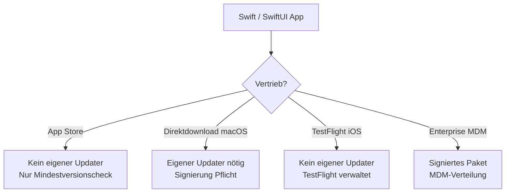

# 09. Swift und SwiftUI

Swift und SwiftUI sind die nativen Entwicklungssprachen für macOS und iOS. Update-Systeme für Swift-Apps unterscheiden sich je nachdem ob die App über den App Store oder direkt vertrieben wird.

---

## Zwei grundverschiedene Vertriebswege



---

## macOS — Direktdownload

### Signierungsanforderungen

Ohne gültiges Apple Developer Certificate und Notarisierung:
- Gatekeeper blockiert den Start
- Nutzer sehen "App kann nicht geöffnet werden"
- Kein Update-Dialog hilft über das hinweg

**Checkliste Signierung:**

- [ ] Apple Developer Account aktiv
- [ ] Developer ID Application Zertifikat vorhanden
- [ ] App mit `codesign` signiert (alle Frameworks eingeschlossen)
- [ ] Notarisierung mit `notarytool` durchgeführt
- [ ] Ticket mit `stapler` eingebunden

### Swift Update-Client (Phase 1)

```swift
import Foundation

struct UpdateManifest: Codable {
    let app: String
    let platform: String
    let latestVersion: String
    let minimumVersion: String
    let downloadUrl: String
    let changelog: [String]
    let forceUpdate: Bool
}

class UpdateService {
    static let shared = UpdateService()
    private let currentVersion = Bundle.main.infoDictionary?["CFBundleShortVersionString"] as? String ?? "0.0.0"
    private let manifestURL = URL(string: "https://updates.example.com/example-app/macos/latest.json")!

    func checkForUpdate() async -> UpdateManifest? {
        do {
            let (data, response) = try await URLSession.shared.data(from: manifestURL)
            guard let httpResponse = response as? HTTPURLResponse,
                  httpResponse.statusCode == 200 else { return nil }

            let manifest = try JSONDecoder().decode(UpdateManifest.self, from: data)

            if isNewer(manifest.latestVersion, than: currentVersion) ||
               isBelowMinimum(currentVersion, minimum: manifest.minimumVersion) {
                return manifest
            }
        } catch {
            // Netzwerkfehler still behandeln
        }
        return nil
    }

    private func isNewer(_ remote: String, than installed: String) -> Bool {
        compareVersions(remote, installed) == .orderedDescending
    }

    private func isBelowMinimum(_ installed: String, minimum: String) -> Bool {
        compareVersions(installed, minimum) == .orderedAscending
    }

    private func compareVersions(_ a: String, _ b: String) -> ComparisonResult {
        a.compare(b, options: .numeric)
    }
}
```

### Verwendung beim App-Start

```swift
// In AppDelegate oder @main struct
Task {
    if let manifest = await UpdateService.shared.checkForUpdate() {
        await MainActor.run {
            showUpdateDialog(manifest: manifest)
        }
    }
}
```

---

## iOS — App Store

Für iOS-Apps die über den App Store vertrieben werden:
- Kein eigener Updater möglich (App Store Policy)
- Eigenes Backend für Mindestversionscheck sinnvoll

```swift
// Nur Mindestversionscheck — kein Installer-Download
func checkMinimumVersion(manifest: UpdateManifest) {
    let installed = currentVersion
    if isBelowMinimum(installed, minimum: manifest.minimumVersion) {
        // Zum App Store weiterleiten
        let appStoreURL = URL(string: "https://apps.apple.com/app/idXXXXXXXXX")!
        UIApplication.shared.open(appStoreURL)
    }
}
```

---

## Manifest-URL-Struktur

```text
https://updates.example.com/example-app/macos/latest.json
https://updates.example.com/example-app/ios/latest.json
```

---

## Sicherheitshinweis

Für macOS-Apps die über Direktdownload vertrieben werden, ist Code-Signierung keine Option — sie ist Pflicht.

Ohne Signierung:
- Nutzer können die App nicht öffnen
- Kein Auto-Updater kann unterschriebene Pakete ausliefern

→ Checkliste: [`../checklists/macos.md`](../checklists/macos.md)

---

## Nächster Schritt

→ Weiter mit [`10-PHP-Backends.md`](10-PHP-Backends.md)
