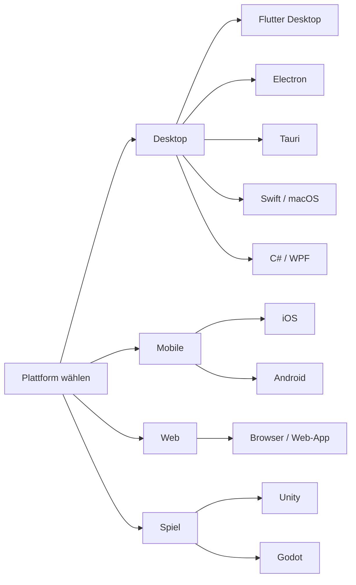

## Plattform-spezifische Hinweise

Der Feedback-Hub funktioniert plattformübergreifend, aber die technische Umsetzung — insbesondere für Screenshots — unterscheidet sich je nach Plattform erheblich.

---

### Plattformübersicht



---

### Desktop-Plattformen

| Merkmal | Flutter Desktop | Electron | Tauri | Swift (macOS) | C# (WPF) |
|---------|----------------|----------|-------|---------------|-----------|
| Screenshot-Zugriff | Vollständig | Vollständig | Vollständig | Vollständig | Vollständig |
| Store-Beschränkungen | Keine | Keine | Keine | Mac App Store: Sandboxing | Windows Store: Minimal |
| System-Infos | Vollständig | Vollständig | Vollständig | Vollständig | Vollständig |

**Empfehlung Desktop:** Keine nennenswerten Einschränkungen. Screenshot der gesamten App-Oberfläche problemlos möglich.

```dart
// Flutter Desktop: Screenshot der aktuellen View
RenderRepaintBoundary boundary = globalKey.currentContext!
  .findRenderObject() as RenderRepaintBoundary;
ui.Image image = await boundary.toImage(pixelRatio: 2.0);
ByteData? byteData = await image.toByteData(
  format: ui.ImageByteFormat.png
);
```

---

### iOS

**Einschränkungen:**
- Kein Screenshot im Hintergrund möglich (nur eigene View-Hierarchie)
- **Privacy Manifest** erforderlich (seit iOS 17) — siehe [Datenschutz](13-Datenschutz.md)
- App Store Review Guidelines §5.1: Datenschutz muss transparent kommuniziert werden
- Nur `UIGraphicsGetCurrentContext` für die eigene View-Hierarchie verwenden

```swift
// iOS: Screenshot der eigenen View
func captureScreen(view: UIView) -> UIImage? {
    UIGraphicsBeginImageContextWithOptions(
        view.bounds.size, false, UIScreen.main.scale
    )
    view.drawHierarchy(in: view.bounds, afterScreenUpdates: true)
    let image = UIGraphicsGetImageFromCurrentImageContext()
    UIGraphicsEndImageContext()
    return image
}
```

> Kein Zugriff auf andere Apps oder den Home Screen. Nur der eigene App-Inhalt kann erfasst werden.

---

### Android

**Einschränkungen:**
- Für Screenshots außerhalb der eigenen App: `MediaProjection API` erforderlich
- Nutzer muss die Berechtigung **explizit erteilen** (System-Dialog erscheint)
- Der Permission-Dialog selbst erscheint im Screenshot — darauf hinweisen

```kotlin
// Android: Screenshot mit MediaProjection (vereinfacht)
val mediaProjectionManager = getSystemService(
    Context.MEDIA_PROJECTION_SERVICE
) as MediaProjectionManager

// Nutzer-Erlaubnis anfordern
startActivityForResult(
    mediaProjectionManager.createScreenCaptureIntent(),
    REQUEST_CODE_SCREEN_CAPTURE
)
```

Für einfachere Fälle (nur eigene App): `View.getDrawingCache()` oder `PixelCopy` API (ab Android 8.0).

---

### Web (Browser)

**Einschränkungen:**
- `html2canvas` ist die empfohlene Bibliothek — aber mit Limitierungen
- **CORS:** Externe Ressourcen (Bilder, Fonts von anderen Domains) werden nicht erfasst
- **iFrames:** Inhalte aus Cross-Origin-iFrames können nicht erfasst werden
- **Custom Fonts:** Müssen lokal verfügbar sein, sonst Fallback
- **Browser-UI:** Kein Zugriff auf Adressleiste, Tabs, Extensions

```javascript
// Web: Screenshot mit html2canvas
import html2canvas from 'html2canvas';

async function captureScreen() {
  const canvas = await html2canvas(document.body, {
    useCORS: true,         // CORS-Ressourcen versuchen
    allowTaint: false,     // Sicher bleiben
    scale: window.devicePixelRatio,
    ignoreElements: (el) => {
      // Sensible Felder ausblenden
      return el.classList.contains('sensitive-data');
    }
  });
  return canvas.toDataURL('image/jpeg', 0.8);
}
```

---

### Unity (Spieleentwicklung)

- Screenshot über `RenderTexture.active` — funktioniert auf allen Plattformen
- Kein Zugriff auf Bereiche außerhalb des Spielfensters

```csharp
// Unity: Screenshot erstellen
IEnumerator CaptureScreenshot() {
    yield return new WaitForEndOfFrame();
    Texture2D screenshot = new Texture2D(
        Screen.width, Screen.height, TextureFormat.RGB24, false
    );
    screenshot.ReadPixels(
        new Rect(0, 0, Screen.width, Screen.height), 0, 0
    );
    screenshot.Apply();
    byte[] bytes = screenshot.EncodeToJPG(80);
    // bytes an Feedback-System senden
}
```

---

### Godot

```gdscript
# Godot: Screenshot erstellen
func capture_screenshot() -> Image:
    var image = get_viewport().get_texture().get_image()
    image.flip_y()  # Godot-Koordinatensystem korrigieren
    return image
```

---

### Plattformübergreifende Architektur

Der Screenshot-Code sollte hinter einem **abstrakten Interface** stehen:

```dart
// Abstraktes Interface (Flutter-Beispiel)
abstract class ScreenshotProvider {
  Future<Uint8List?> captureScreen();
}

// Implementierungen pro Plattform
class DesktopScreenshotProvider implements ScreenshotProvider { ... }
class MobileScreenshotProvider implements ScreenshotProvider { ... }
class WebScreenshotProvider implements ScreenshotProvider { ... }
```

Dies ermöglicht plattformspezifische Implementierungen ohne Änderungen am Rest des Feedback-Hubs.

---

→ Weiter mit [wiki/15-FAQ.md](15-FAQ.md)
